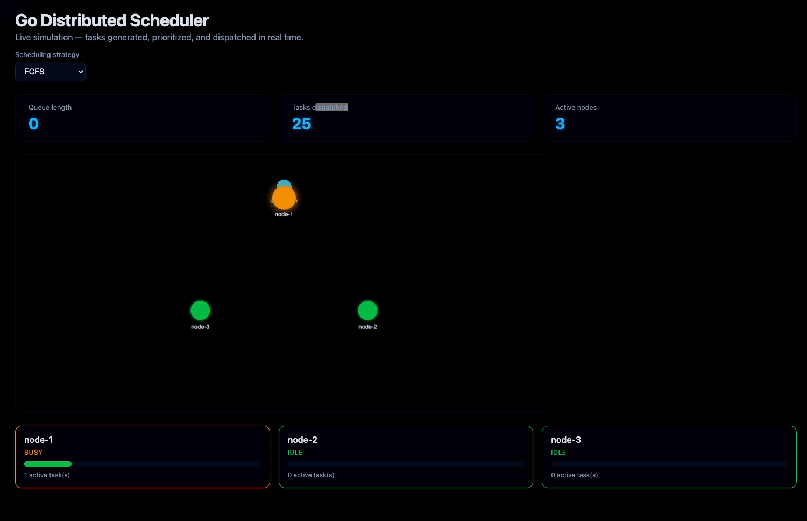

# Go Distributed Scheduler

A real-time distributed task scheduler built in Go, reimagined from a university C project using goroutines, channels, and a live animated dashboard.

Tasks are generated continuously, prioritized, and dispatched across simulated worker nodes — with the entire flow visualized live in the browser via Server-Sent Events.



## Why this exists

The original version of this scheduler was written in C using POSIX threads as a university systems programming project. This rewrite reimplements the same core ideas — concurrent task scheduling across independent nodes — using Go's concurrency model, plus a real-time visual layer that makes the scheduling behavior observable instead of just logged to a terminal.

## Features

- Multi-node task scheduler using goroutines and channels
- Three interchangeable scheduling strategies: Priority, FCFS, Round Robin
- Thread-safe node manager with load-aware assignment
- Live simulation loop generating and dispatching tasks every second
- REST API exposing node state, queue depth, and metrics
- Server-Sent Events stream for instant dashboard updates (no polling)
- Animated canvas visualization showing tasks flowing from scheduler to nodes in real time

## Architecture

```text
                 ┌─────────────────┐
                 │   Simulation     │
                 │  (task generator)│
                 └────────┬─────────┘
                          │ Submit()
                          ▼
                 ┌─────────────────┐
                 │    Scheduler     │
                 │ (priority/fcfs/  │
                 │  round robin)    │
                 └────────┬─────────┘
                          │ Next() + assign
                          ▼
                 ┌─────────────────┐
                 │  Node Manager    │
                 │ (load tracking)  │
                 └────────┬─────────┘
                          │ state changes
                          ▼
                 ┌─────────────────┐
                 │   API + SSE      │
                 │ (broadcaster)    │
                 └────────┬─────────┘
                          │ live JSON stream
                          ▼
                 ┌─────────────────┐
                 │  Browser Dashboard│
                 │ (canvas + cards) │
                 └─────────────────┘
```

## Project structure

```text
cmd/server/          Entry point, wires everything together
internal/scheduler/  Task struct, priority queue, scheduling strategies
internal/node/        Node manager, load tracking, least-loaded selection
internal/simulation/  Task generation loop, dispatch logic
internal/api/         REST endpoints, SSE broadcaster
web/                  Dashboard: canvas animation, node cards, strategy switcher
```

## Running locally

```bash
git clone https://github.com/anishgondhi04/go-distributed-scheduler.git
cd go-distributed-scheduler
go run ./cmd/server
```

Then open [http://localhost:8080](http://localhost:8080) in your browser.

## API endpoints

| Endpoint | Method | Description |
|---|---|---|
| `/health` | GET | Health check |
| `/api/nodes` | GET | Current node states |
| `/api/queue` | GET | Current queue length |
| `/api/metrics` | GET | Tasks dispatched, uptime, queue length |
| `/api/strategy` | GET/POST | Get or set the active scheduling strategy |
| `/api/stream` | GET | Server-Sent Events live state stream |

## Running tests

```bash
go test ./...
```

## Roadmap

See [docs/roadmap.md](docs/roadmap.md) for planned work, tracked via GitHub Issues and Milestones.

## Background

This project was originally built in C as [Multi_Node_Scheduler](https://github.com/anishgondhi04/Multi_Node_Scheduler), a thread-safe distributed scheduler using POSIX threads. This Go version keeps the core concept but rebuilds the concurrency model, adds a live web dashboard, and exposes the scheduler as a real, running service instead of a terminal simulation.